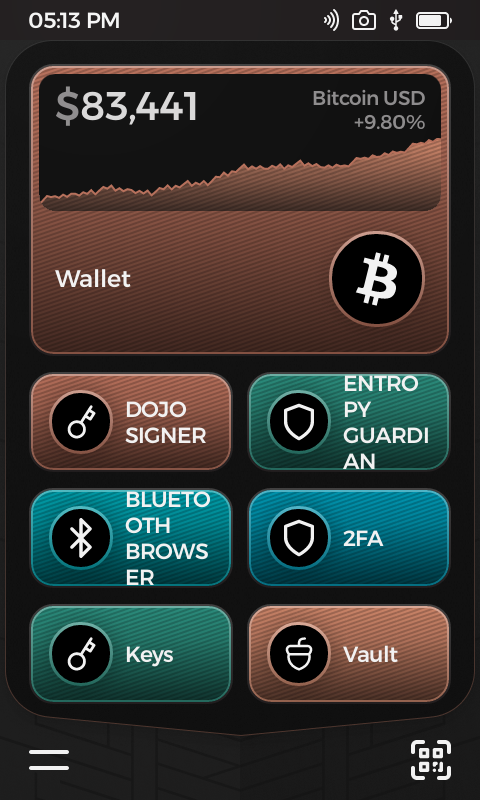
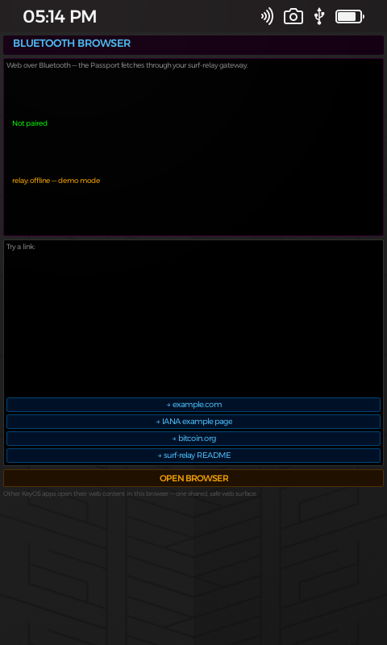
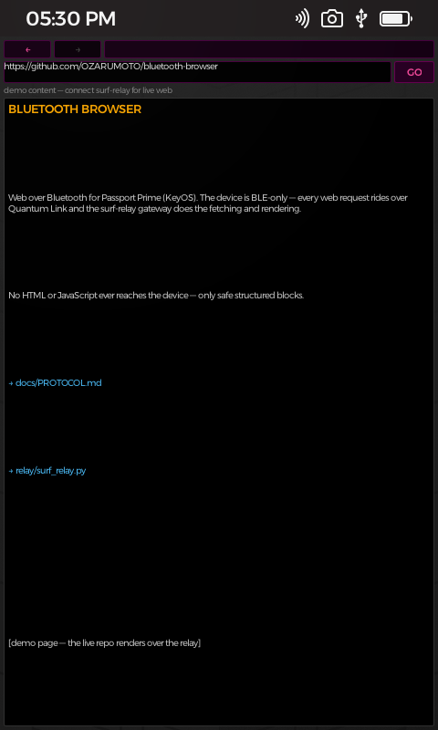
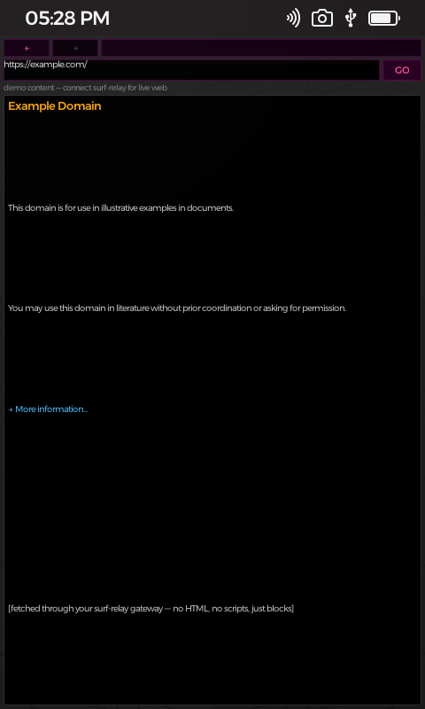
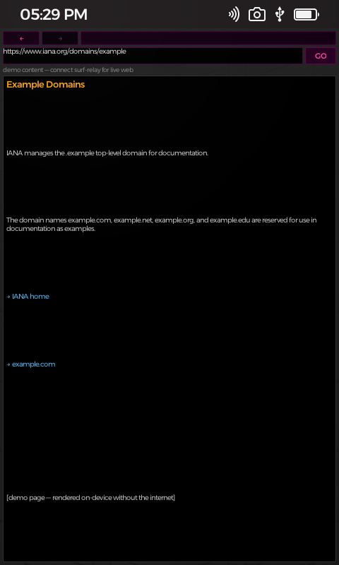
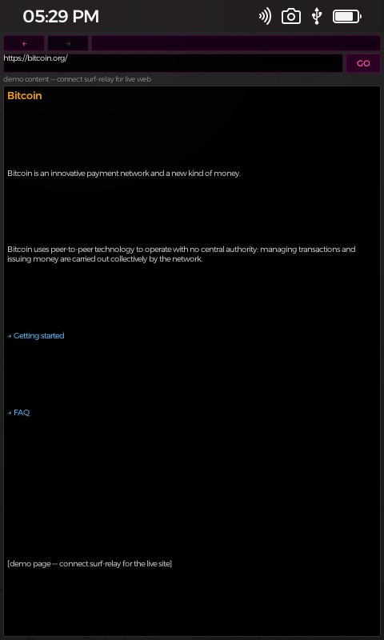
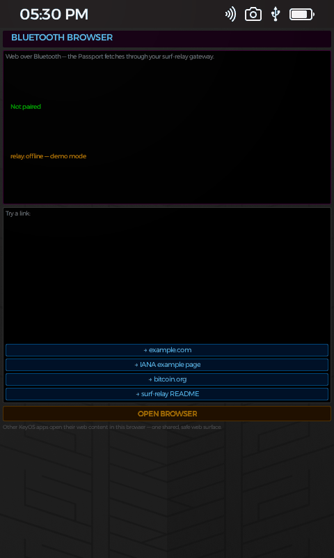

# 🌐 BLUETOOTH BROWSER — web on a BLE-only hardware wallet

A **system browser for Passport Prime (KeyOS)**. The Passport has no Wi-Fi and
no cellular — only Bluetooth LE — so it can never reach the internet alone.
BLUETOOTH BROWSER turns that constraint into a feature:

```
┌────────────────────────────  Passport Prime  ────────────────────────────┐
│  BLUETOOTH BROWSER / DOJO SIGNER (KeyOS apps)                            │
│   • web via safe page blocks · cold-signs transactions                    │
└───────────────▲───────────────────────────────────────────────────────────┘
                │ Quantum Link — JSON envelopes, channel "web-0"
                │ BLE: NUS service (Nordic UART) — sealed GSTP envelopes
┌───────────────▼───────────────────────────────────────────────────────────┐
│  surf-bridge (bridge/, on your box)                                       │
│   • BLE radio on the box pairs with the Passport like a companion app     │
│   • unseals web-0 envelopes with your own XID identity (Kyber crypto)     │
│   • forwards them over TCP — NO PHONE, NO ENVOY                           │
└───────────────▲───────────────────────────────────────────────────────────┘
                │ TCP 8787 — one JSON envelope per line
┌───────────────▼───────────────────────────────────────────────────────────┐
│  surf-relay  (your box / Mac / any gateway with internet)                 │
│   • receives fetch requests · downloads pages (Tor or clearnet)           │
│   • HTML → clean blocks: text, headings, links, quotes, code              │
│   • broadcasts signed txs straight to YOUR bitcoin node (cookie auth)     │
│   • scripts, styles, tracking and unsafe links stripped                   │
└────────────────────────────────────────────────────────────────────────────┘
```

**The security model is untouched:** the signing device stays a signing
device. The browser touches **no seed, no wallet, no key material** — it only
renders text the relay prepared. A hostile page cannot execute anything on the
device, and the relay caps page size and block count so a hostile page cannot
exhaust device memory.

## ✨ Features

- **System browser** — one shared web surface. Any KeyOS app (RoboSats,
  Dojo Signer, a future exchange) asks the browser to open a URL via the
  `open-url` channel; the browser fetches and renders it.
- **Address bar + GO** with on-device keyboard input.
- **Back / forward / home** with a per-session history (re-fetches cached
  pages instantly).
- **Page blocks**: headings, paragraphs, tappable links, quotes, code,
  separators — a readable web on a 480×800 screen.
- **Relay status**: pairing + relay-online indicators on the start page.
- **Broadcast gateway** — a `broadcast` envelope carries a signed raw tx
  (e.g. from **Dojo Signer**) to **your own bitcoind** over cookie auth; the
  node-confirmed txid comes back in `broadcast-result`. No third party ever
  sees the transaction.
- **Companion HTTP surface** — `POST /broadcast` on port 8788 speaks the
  same envelope, so the **Envoy companion** relays a device's signed PSBT to
  your node on real hardware (sign on device → BLE → companion → relay →
  your bitcoind).
- **No-phone mode** — [`bridge/`](bridge/) is a Rust daemon that puts a BLE
  radio on the box itself: the Passport pairs directly with your box (same
  Quantum Link protocol Envoy uses) and the companion disappears entirely.
  Hardware truth: the device is BLE-only, so *something* with BLE + internet
  must carry traffic — the point is that thing can be your box, not a phone.
- **Demo mode**: without a relay (e.g., the simulator), the app still boots to
  a start page and can render sample pages so the UI is fully explorable.

## 🧱 Repo layout

```
├── gui-app-browser/        # the KeyOS app (slint UI + QL wiring)
│   ├── src/main.rs         # fetch/page state machine, history, QL channel
│   └── ui/                 # app.slint + home/browse pages + callbacks
├── relay/surf_relay.py     # the internet gateway (python3, stdlib only)
├── bridge/                 # surf-bridge: BLE daemon (Rust) — phone-free mode
│   ├── src/ble.rs          #   NUS transport (scan/connect/notify/write)
│   ├── src/ql.rs           #   seal/unseal + BTP chunking (Foundation crypto)
│   ├── src/router.rs       #   web-0 envelope routing → surf-relay
│   └── src/identity.rs     #   persisted bridge identity + device XID
└── docs/PROTOCOL.md        # the companion ↔ device wire spec
```

## 🚀 Run it

**Relay (any machine with python3):**

```bash
python3 relay/surf_relay.py --port 8787                 # clearnet (binds 127.0.0.1)
python3 relay/surf_relay.py --socks 127.0.0.1:9050      # through Tor
python3 relay/surf_relay.py --self-test https://example.com
python3 relay/surf_relay.py --self-broadcast <txhex>    # broadcast one tx via your node
# defaults for the broadcast node: http://127.0.0.1:8332 + ~/.bitcoin/.cookie
# (override with --rpc-url / --rpc-cookie, or SURF_RPC_URL / SURF_RPC_COOKIE)
# the relay binds localhost by default — use --bind 0.0.0.0 only when a
# LAN BLE-bridge/companion needs it, behind your own firewall rules
# companion HTTP endpoint: POST /broadcast on --http-port 8788 (0 disables)
```

**App:** register `gui-app-browser` in the KeyOS workspace (workspace member +
xtask DEFAULT lists), then `cargo xtask run --hosted` and open
**BLUETOOTH BROWSER** on the home screen.

## 📸 It running on the Passport Prime simulator

Real captures of **BLUETOOTH BROWSER** on the KeyOS hosted simulator (Passport
Prime home screen + the browser itself). The captures are embedded below so
they render directly on GitHub:

### Passport home screen



### Browser start page



### Browser view



### Rendered page blocks

| Example.com | IANA | bitcoin.org |
|---|---|---|
|  |  |  |

### 🎬 Walkthrough video

The complete hands-on walkthrough is embedded here as an animated GIF:



[Open the full-resolution walkthrough GIF](media/walkthroughallbrowsers.gif)

## 🔐 Security

| Property | Guarantee |
|---|---|
| No network on device | QL envelopes only — the device never opens a socket |
| No script on device | Relay strips JS/CSS; device renders text blocks |
| Safe links only | Absolute http(s) only; javascript:/data: dropped |
| Size caps | 512 KB pages, bounded block count |
| No keys | The browser never touches the seed or wallet |
| Broadcast privacy | Signed txs go to **your node** (cookie auth) — never a public API |

## 📜 License

GPL-3.0-or-later — matching the KeyOS ecosystem.
